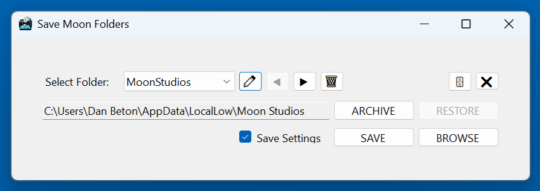

# README #

Simple C# app to archive the saves folder for "No Rest For The Wicked: Breach". Can archive other folders as well, just add them to the list.

### Dependencies ###

C#, Config.NET

### Build Instructions ###

Just open the .sln and compile. If there are issues, delete the settings.json file from the Debug/Release build folder.

